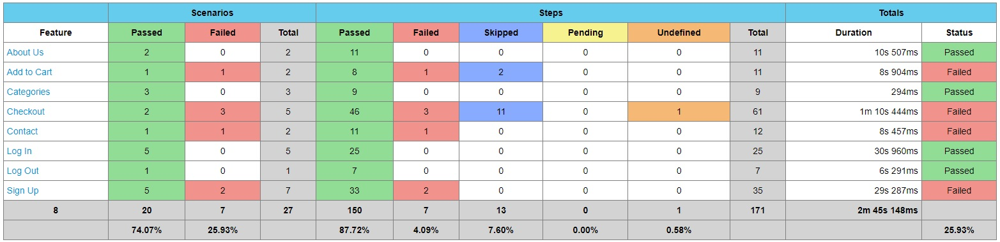

 

<h1 style="display-inline:block">Web Automation Testing (Demoblaze.com)</h1>

Web Automation Testing using Serenity BDD on website Demoblaze.com  

## About This Project
Demoblaze.com is a static website for performing web automation testing. In this project, I created test scenarios (divided into several features) starting from sign up, login, selecting categories, choosing products, adding them to the cart, completing the checkout process, and ending with adding a message.

In terms of the technology stack, I utilized Selenium Java, Serenity BDD, Maven, Cucumber, and Gherkin.

You can access the details of the manual test case and testing report through the link above.

## Automation Report
 

## Tools

Manual Testing

      
      
Test Case Management

      
      
Automation Testing

      
      
      
      
      
      
      
      
Management Project

      

## Quality Assurance Engineer:
[Muhammad Faruqi Rabbani](https://github.com/ukifar)   

## How to Run This Project:
* Run this project from IDE:
    * Open this project from your IDE
    * Open your IDE terminal
    * Type and run this command on your IDE terminal:
      > mvn clean verify
######
* Run this project from terminal:
    * Open your terminal
    * Change your directory to where you place this project on your machine using this command:
      > cd your-project-directory-path
    * Type and run this command on your terminal:
      > mvn clean verify
